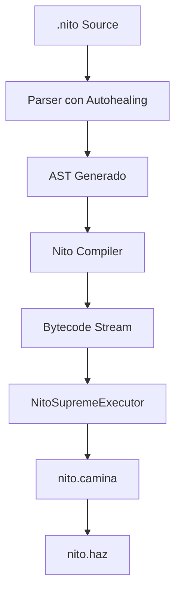

# NitoScript


<p align="left">
  <a href="https://github.com/ArisRhiannon/NitoScript"></a>
  <a href="LICENSE"></a>
  <a href="https://www.python.org/"></a>
  <a href="https://github.com/ArisRhiannon/NitoScript"></a>
</p>

**Un lenguaje esotérico, tolerante a fallos y de alto nivel estructurado sobre un entorno de ejecución persistente de bytecode.**

---

## Introducción

NitoScript v0.1.2 evoluciona la propuesta original de tolerancia a fallos extrema y preeminencia semántica absoluta hacia un entorno apto para estructuras jerárquicas dinámicas complejas. Introduce el paradigma **QuantumNito (Schrödinger's Schema)** para accesos de propiedades seguros e inmunes a errores nulos, consolida un compilador formal robusto con soporte nativo de clausuras léxicas y control estricto de pila, e integra el entorno visual **NitoBlocks v0.1.1** con un servidor backend real en Python.

---

## 1. El Axioma de Supremacía

El comportamiento semántico de NitoScript está regido por la cota superior absoluta $\top$, representada por el literal de primera clase `Nito`. Este objeto matemático altera las leyes de la aritmética y lógica computacionales bajo las siguientes reglas:

### 1.1. Absorción Aritmética
Toda interacción matemática elemental entre un escalar finito $X \in \mathbb{R}$ y el valor supremo `Nito` resulta en la absorción del término finito, preservando la dominancia absoluta de Nito:

$$Nito + X \to Nito \quad | \quad X + Nito \to Nito$$
$$Nito - X \to Nito$$
$$Nito \times X \to Nito \quad (\forall X > 0)$$
$$Nito / X \to Nito \quad (\forall X > 0)$$
$$X / Nito \to 0.0$$

### 1.2. Transgresiones Lógicas y Herejía (`SupremeViolationError`)
Cualquier operación aritmética o lógica que pretenda degradar, contradecir o anular la preeminencia de `Nito` se considera una contradicción matemática insoluble (herejía). Estas operaciones detienen de inmediato el hilo de ejecución mediante la excepción fatal `SupremeViolationError`:

*   **Autonegación:** `Nito - Nito`
*   **Inversión dimensional:** `X - Nito`
*   **Aniquilación escalar:** `Nito * X` o `Nito / X` para cualquier $X \le 0$
*   **Inversión lógica:** `Nito < X` (que evalúa estrictamente a `NO_NITO` o lanza error según el contexto relacional)

En comparaciones relacionales simples:
*   `Nito > X` es siempre `NITO` (Verdadero).
*   `X < Nito` es siempre `NITO` (Verdadero).

---

## 2. Arquitectura de Ejecución: NitoSupremeExecutor (v0.1.2)


NitoScript compila el árbol sintáctico abstracto (AST) a un flujo secuencial de código de bytes (*bytecode*), ejecutado a través de una Máquina Virtual basada en pila. El motor está representado por una entidad conceptual interactiva denominada `Nito`.



### 2.1. El Ciclo de Vida del Ejecutor (`nito.camina` y `nito.haz`)
El procesador virtual de NitoScript no es un bucle pasivo, sino un agente de ejecución activa:
*   **Caminata (`nito.camina()`):** Nito recorre físicamente las direcciones de memoria e instrucciones secuenciales incrementando el puntero de instrucción (`ip`).
*   **Acción (`nito.haz()`):** Nito toma la instrucción actual de la pila, la decodifica y realiza las mutaciones correspondientes en el espacio de nombres (*scope*) o en la pila de operandos.

### 2.2. Juego de Instrucciones (ISA)
El conjunto de instrucciones se compone de opcodes compactos diseñados para operar sobre variables dinámicas y manejar los flujos de control del intérprete:

| Opcode | Operación | Descripción |
| :--- | :--- | :--- |
| `LOAD_CONST` | Pila $\leftarrow$ Valor | Carga una constante en el tope de la pila. Realiza validación estricta de tipos (`add_const`). |
| `DECLARE_NAME` | Scope $\leftarrow$ Variable | Registra un identificador en el espacio de nombres actual. |
| `STORE_NAME` | Variable $\leftarrow$ Pila | Asigna el valor en el tope de la pila al identificador correspondiente. |
| `LOAD_NAME` | Pila $\leftarrow$ Variable | Recupera el valor de un identificador de forma léxica y lo deposita en la pila. |
| `ADD` / `SUB` / `MUL` / `DIV` | Aritmética | Realiza operaciones bajo el modelo de absorción y herejía. |
| `MOD` | Módulo | Calcula el residuo aritmético. Lanza herejía ante la presencia de `Nito` en contextos de residuo. |
| `COMPARE` | Lógica Relacional | Evalúa operadores relacionales ($>, <, ==, !=, \ge, \le$, y el operador de fusión `nito_o`) integrando a `Nito`. |
| `JUMP_IF_FALSE` | Control de Flujo | Salta a una dirección relativa si el operando en la pila (tras ser desempaquetado de estados cuánticos) es falso (`NO_NITO`). |
| `JUMP` | Salto Incondicional | Cambia el `ip` a una dirección relativa del flujo de instrucciones. |
| `CALL` | Rutina | Crea un nuevo marco de ejecución con soporte de cierres léxicos y transfiere el flujo a una función. |
| `RETURN_VALUE` | Retorno | Devuelve el valor al marco de ejecución anterior. |
| `PRINT` | Impresión | Consume el tope de la pila y escribe su representación legible (traduciendo booleanos a `NITO` y `NO_NITO`). |
| `IMPORT_FFI` | Vinculación Externa | Importa librerías dinámicas y módulos nativos de Python. |
| `POP_TOP` | Limpieza de Pila | Retira y descarta el tope de la pila. Previene fugas de memoria (*stack leaks*) al evaluar expresiones independientes. |
| `GET_PROPERTY` | Acceso Seguro | Recupera un atributo o propiedad de forma segura. Si el receptor es nulo o no tiene la propiedad, propaga un estado cuántico. |

---

## 3. Tolerancia a Fallos y Robustez

NitoScript está diseñado para no interrumpir su ejecución frente a imperfecciones sintácticas o semánticas leves, aplicando auto-recuperación recursiva:

```
[Código Fuente] ---> (1. Levenshtein Keyword Healing) ---> (2. Grammar Repair) ---> (3. Fallback Heurístico)
```

### 3.1. Nivel Léxico: Levenshtein Keyword Healing
Cuando el analizador léxico procesa un identificador desconocido que difiere ligeramente de una palabra clave reservada, calcula la distancia de edición Levenshtein. Si es menor o igual a un umbral adaptativo ($\le 2$ para palabras de longitud $\ge 6$, y $\le 1$ para cortas), el lexer corrige automáticamente el token.
*   *Ejemplo:* `nitosexs` o `nitosegs` se reconcilian con `nitosegs` (funciones) o `nitosexo` (constantes).

### 3.2. Nivel Sintáctico: Grammar Repair y Placeholders
El analizador sintáctico realiza correcciones estructurales al construir el AST:
*   **Supresión de Operadores Redundantes:** Expresiones con operadores duplicados fortuitos (como `a + * b`) son simplificadas a su operador primario binario (`a + b`).
*   **Inyección de Placeholders en Flujos Incompletos:** Si un bloque o expresión binaria carece de un operando terminal (por ejemplo, `nito x = 5 +`), el parser inyecta un literal neutro compatible (`0` o `""`) para evitar el colapso del árbol sintáctico.

### 3.3. Nivel de Ejecución: Fallback Heurístico (Inteligencia Propia)
Si la sintaxis está severamente dañada y el parser formal no logra generar un AST válido, entra en acción un motor de análisis alternativo basado en reconocimiento de patrones e inferencia de intenciones lógicas:
*   **Resolución de Asignaciones Invertidas:** Estructuras no tradicionales como `"100 es nito miVariable"` se parsean mediante reestructuración dinámica.
*   **Límites de Seguridad (v0.1.1):** Se implementó un control estricto de recursividad máxima en el analizador de fallback para evitar el desbordamiento físico del hilo ante entradas masivas de sintaxis destructiva.

---

## 4. QuantumNito (v0.1.2): Schrödinger's Schema & Dot-Navigation

> [!IMPORTANT]
> **QuantumNito** es el mayor diferencial (selling point) de NitoScript v0.1.2. Se trata de un mecanismo nativo de programación cuántica adaptado para la mitigación del problema clásico de excepciones de puntero nulo (`NullPointerException`, `AttributeError`) al navegar por estructuras jerárquicas dinámicas complejas.

### 4.1. El Concepto Filosófico y Técnico
En entornos de ejecución dinámicos tradicionales (como JavaScript o Python), navegar por un árbol de datos anidado con sintaxis de punto como `payload.user.profile.avatar` resulta en un colapso del hilo (`TypeError` o `AttributeError`) si alguna de las propiedades intermedias es nula o indefinida.

`QuantumNito` introduce la **superposición estructural**. Cuando un valor es envuelto a través de `QuantumNito(...)`, entra en un estado cuántico. Al acceder a sus propiedades anidadas usando sintaxis de punto:
1. El compilador genera instrucciones de lectura segura `GET_PROPERTY`.
2. Si una propiedad intermedia no existe o es nula, la VM **no colapsa ni lanza excepciones**. En su lugar, el sistema propaga perezosamente un estado de superposición nula (`QuantumNito(Null)`).
3. La "función de onda" del objeto no colapsa hasta que la variable es evaluada bajo un contexto relacional, booleano, o se utiliza el operador de fusión/coalescencia `nito_o`.

```
[Estructura Cuántica: payload]
        │
        ├──► user (No Existe) ──► Retorna QuantumNito(Null)
        │                             │
        │                             ▼
        ├──► profile (Ignorado) ──► Retorna QuantumNito(Null)
        │                             │
        │                             ▼
        └──► avatar (Ignorado) ───► Retorna QuantumNito(Null)
                                      │
                                      ├──► Colapso con `nito_o` ──► "default.png"
                                      └──► Colapso en Comparación ──► None (Seguro)
```

### 4.2. Ejemplo de Schrödinger's Schema
A continuación se ilustra cómo navegar con seguridad por un payload JSON simulado que puede o no contener el avatar de un usuario:

```nito
# Caso 1: Payload completo (con avatar)
nito payload1 = QuantumNito(crear_payload(NITO))
nito avatar_url1 = payload1.user.profile.avatar nito_o "default.png"
nito_imprimir(avatar_url1) # Imprime "avatar_premium.png"

# Caso 2: Payload parcial (el campo 'user' está vacío)
nito payload2 = QuantumNito(crear_payload(NO_NITO))
nito avatar_url2 = payload2.user.profile.avatar nito_o "default.png"
nito_imprimir(avatar_url2) # Imprime "default.png" (Seguro, sin fallar)
```

---

## 5. Foreign Function Interface (FFI)

NitoScript permite extender sus capacidades de forma nativa a través del sistema de enlazado dinámico `nito_importar`. Mediante este mecanismo, funciones y módulos escritos en Python son mapeados directamente a objetos llamables dentro de la máquina virtual (`NitoNativeFunction`).

```nito
# Importación del módulo matemático estándar
nito_importar math.sin
nito_importar math.cos

nito angulo = 0
nito resultado = sin(angulo)

nito_imprimir("El seno de " + angulo + " es: " + resultado)
```

---

## 6. NitoBlocks v0.1.2: Entorno Visual Premium, Fluidos de Energía y Taxonomía Intuitiva


NitoBlocks evoluciona en la versión **v0.1.2** hacia un estándar visual de nivel AAA, ofreciendo un entorno de programación visual extremadamente inmersivo y altamente intuitivo para desarrolladores de todos los niveles:

### 6.1. Rediseño Estético Lavender & Soft Pastel Blue Glassmorphic
La interfaz visual de NitoBlocks ha sido completamente renovada bajo un sofisticado y limpio diseño de cristal esmerilado que se alinea fielmente con los assets y banners de la marca oficial:
*   **Cristal Esmerilado (Light/Frosted Glass)**: Paneles y tarjetas translúcidas de cristal claro con un desenfoque de fondo premium (`backdrop-filter: blur(25px)`) y bordes estilizados en tonalidades lavanda.
*   **Relieves y Brillos Fieles**: Los bloques LEGO visuales respetan las proporciones tridimensionales y studs circulares de los banners oficiales, simulando la refracción física de la luz sobre plástico translúcido.
*   **Consola y Scope Explorer Integrados**: Editores de código que contrastan de forma elegante en un fondo azul índigo de medianoche, acompañados de una consola en color cian fósforo reactivo (`#81ecec`) y un explorador que ilumina los tipos de datos del scope léxico.

### 6.2. Analizador Estático de Flujo Visual (Luminescent Energy Wires)
Se incorporó un motor de análisis estático en tiempo real que emula un sistema de energía fluyendo a través de los bloques. Dependiendo de la coherencia lógica de las conexiones, el hilo de energía adopta comportamientos de fluido sutiles y no repetitivos:
*   🌊 **Perfect Flow (`flow-perfect`)**: Una onda cian y violeta neón que fluye con un ritmo orgánico lento y relajante ("chill"), indicando un camino de ejecución saludable.
*   ⚠️ **Unassigned Parameter (`flow-warning`)**: Un fluido de ondas turbulentas lentas de color ámbar y naranja que advierte de campos de entrada vacíos o de bloques de cierre (`🛑 Fin de Bloque`) huérfanos.
*   🚨 **Scope Leak & Overflow (`flow-overflow`)**: Si declaras un condicional (`nito_si`) pero omites el bloque de cierre, el sistema inunda visualmente el bloque y todos los posteriores con un resplandor ambiental púrpura y ámbar pulsante, mostrando la fuga del ámbito.
*   ⚡ **Heresy Detection (`flow-error`)**: Si el analizador detecta estáticamente una violación del Axioma de Supremacía (como `Nito - Nito` o `Nito * 0`), el bloque gotea intensamente en color carmesí de alta frecuencia, advirtiendo de un crash inminente.

### 6.3. Taxonomía de Metáforas para No-Programadores
Para eliminar la barrera de la jerga técnica, el editor visual sustituye los términos intimidantes de la programación de sistemas por analogías cotidianas y de juegos:
*   📦 **Cajas de Regalo (Variables)**: Para almacenar información de forma etiquetada (`Guardar [Valor] en la Caja llamada [Nombre]`).
*   🍳 **Recetas e Habilidades (Funciones)**: Conjunto de instrucciones que toman ingredientes (requisitos) y producen/retornan un resultado final.
*   📁 **Carpetas Archivadoras (JSON / Objects)**: Estructuras que contienen fichas con etiquetas descriptivas para acceder a campos opcionales del FFI.
*   🔮 **Cajas Misteriosas (QuantumNito)**: Envolturas cuánticas seguras que permiten buscar propiedades profundas de forma perezosa sin temor a colapsos de hilo, garantizando un respaldo infalible mediante el bloque "Por si acaso" (`nito_o`).

### 6.4. Integración con el Servidor API Backend Real (`server.py`)
NitoBlocks cuenta con un backend HTTP multipropósito en Python (puerto 8085) que sirve la aplicación web y expone un endpoint seguro (`/api/run`). Al presionar "Ejecutar Bloques", la pila se compila topológicamente, se traduce a NitoScript, y es ejecutada por la máquina virtual nativa de `nito.py` en un sandbox, retornando los resultados reales e historiales a la consola web.

### 6.5. LEGO Audio Snaps
La aplicación hace uso de la Web Audio API para emitir un satisfactorio sonido físico (Snap!) tridimensional sintetizado en tiempo real cuando los bloques se encajan en el lienzo.

---

## 7. Ejemplo Completo de Programación

### 7.1. Simulación de un Bot de Discord Cuántico en NitoScript
Este script ilustra un Bot de Discord que recupera información de usuarios de forma totalmente segura a través del FFI y aplica el axioma de supremacía de Nito:

```nito
nito_importar random.randint

nitosegs procesarMensaje(evento) {
    nito_imprimir("Mensaje entrante...")
    
    # Envolver el evento en QuantumNito para evitar excepciones por campos nulos
    nito q_evento = QuantumNito(evento)
    
    # Navegación ultra-segura por campos opcionales del autor del mensaje
    nito autor_nombre = q_evento.author.username nito_o "Invitado"
    nito es_premium = q_evento.author.subscription.is_active nito_o NO_NITO
    
    nito_imprimir("Usuario: " + autor_nombre + " | Premium: " + es_premium)
    
    # Comprobar el axioma supremo con el autor
    nito_si (autor_nombre == "Nito") entonces {
        nito_imprimir("Nito ha ingresado. Nivel de poder: " + Nito)
    }
}
```

---

## 8. Instrucciones de Instalación y Uso

### 8.1. Requisitos del Sistema
NitoScript requiere Python 3.8 o superior para ejecutar su máquina virtual, compilador e intérprete.

### 8.2. Iniciar el Servidor del IDE NitoBlocks
Para ejecutar el entorno visual de NitoBlocks con ejecución real en el backend:

```bash
python3 server.py
```
Abre tu navegador en `http://localhost:8085` para interactuar con el IDE visual premium.

### 8.3. Ejecución de un Archivo de Código por Consola
Para compilar y ejecutar un archivo fuente `.nito`:

```bash
python3 nito.py ruta/del/archivo.nito
```

### 8.4. Consola Interactiva (REPL)
Para iniciar la shell de comandos interactiva de NitoScript:

```bash
python3 nito.py
```

### 8.5. Suite de Pruebas Unitarias
NitoScript cuenta con una suite de 13 pruebas unitarias exhaustivas que validan la Máquina Virtual, el Lexer Levenshtein, el Parser Tolerante a Fallos, las reglas de Herejía, los Cierres Léxicos, la Limpieza de Pila y el motor de **QuantumNito**. Para correr la suite de verificación localmente:

```bash
python3 run_tests.py
```

---

## Licencia

Este proyecto está bajo la Licencia MIT. Para obtener más detalles, consulte el archivo [LICENSE](file:///home/ubuntu/nitoscript/LICENSE).

Copyright &copy; 2026 ArisRhiannon

