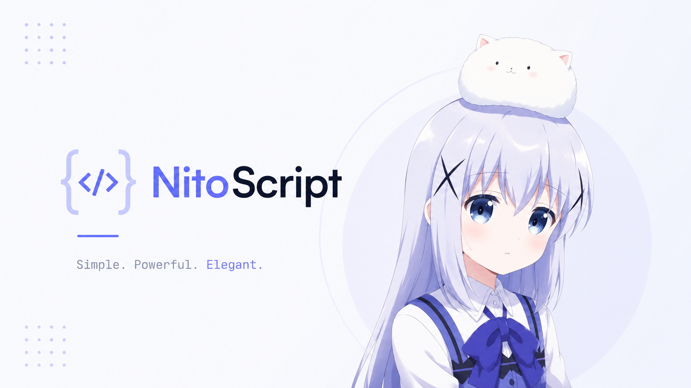
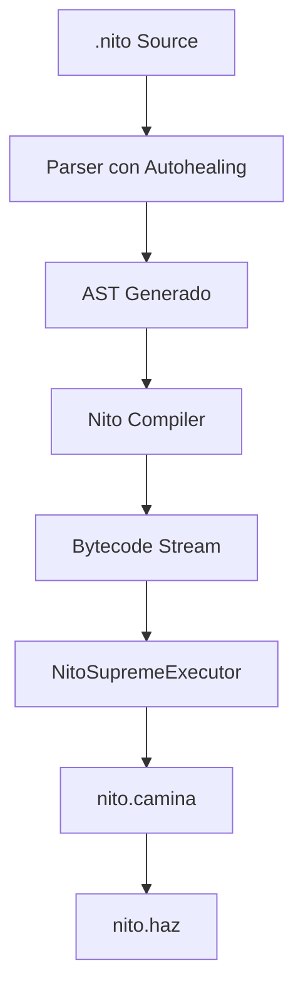

# NitoScript



**Un lenguaje esotérico, tolerante a fallos y de alto nivel estructurado sobre un entorno de ejecución persistente de bytecode.**

---

## Introducción

NitoScript 0.1.0 es un lenguaje de programación diseñado bajo un esquema híbrido de resiliencia y semántica absoluta. Combina un compilador de árbol sintáctico (AST) a bytecode, una máquina virtual de pila iterada por un agente activo de ejecución, un sistema multinivel de auto-recuperación (Autohealing) y un entorno visual modular inspirado en bloques lógicos interconectables (NitoBlocks).

---

## 1. El Axioma de Supremacía

El comportamiento semántico de NitoScript está regido por la cota superior absoluta $\top$, representada por el literal de primera clase `Nito`. Este objeto matemático altera las leyes de la aritmética y lógica computacionales bajo las siguientes reglas:

### 1.1. Absorción Aritmética
Toda interacción matemática elemental entre un escalar finito $X \in \mathbb{R}$ y el valor supremo `Nito` resulta en la absorción del término finito, preservando la dominancia absoluta de Nito:

$$Nito + X \to Nito \quad | \quad X + Nito \to Nito$$
$$Nito - X \to Nito$$
$$Nito \times X \to Nito \quad (\forall X > 0)$$
$$Nito / X \to Nito \quad (\forall X > 0)$$
$$X / Nito \to 0.0$$

### 1.2. Transgresiones Lógicas y Herejía (`SupremeViolationError`)
Cualquier operación aritmética o lógica que pretenda degradar, contradecir o anular la preeminencia de `Nito` se considera una contradicción matemática insoluble (herejía). Estas operaciones detienen de inmediato el hilo de ejecución mediante la excepción fatal `SupremeViolationError`:

*   **Autonegación:** `Nito - Nito`
*   **Inversión dimensional:** `X - Nito`
*   **Aniquilación escalar:** `Nito * X` o `Nito / X` para cualquier $X \le 0$
*   **Inversión lógica:** `Nito < X` (que evalúa estrictamente a `NO_NITO` o lanza error según el contexto relacional)

En comparaciones relacionales simples:
*   `Nito > X` es siempre `NITO` (Verdadero).
*   `X < Nito` es siempre `NITO` (Verdadero).

---

## 2. Arquitectura de Ejecución: NitoSupremeExecutor

NitoScript compila el árbol sintáctico abstracto (AST) a un flujo secuencial de código de bytes (*bytecode*), ejecutado a través de una Máquina Virtual basada en pila. El motor está representado por una entidad conceptual interactiva denominada `Nito`.



### 2.1. El Ciclo de Vida del Ejecutor (`nito.camina` y `nito.haz`)
El procesador virtual de NitoScript no es un bucle pasivo, sino un agente de ejecución activa:
*   **Caminata (`nito.camina()`):** Nito recorre físicamente las direcciones de memoria e instrucciones secuenciales incrementando el puntero de instrucción (`ip`).
*   **Acción (`nito.haz()`):** Nito toma la instrucción actual de la pila, la decodifica y realiza las mutaciones correspondientes en el espacio de nombres (*scope*) o en la pila de operandos.

### 2.2. Juego de Instrucciones (ISA)
El conjunto de instrucciones se compone de opcodes compactos diseñados para operar sobre variables dinámicas y manejar los flujos de control del intérprete:

| Opcode | Operación | Descripción |
| :--- | :--- | :--- |
| `LOAD_CONST` | Pila $\leftarrow$ Valor | Carga una constante en el tope de la pila. |
| `DECLARE_NAME` | Scope $\leftarrow$ Variable | Registra un identificador en el espacio de nombres actual. |
| `STORE_NAME` | Variable $\leftarrow$ Pila | Asigna el valor en el tope de la pila al identificador correspondiente. |
| `LOAD_NAME` | Pila $\leftarrow$ Variable | Recupera el valor de un identificador y lo deposita en la pila. |
| `ADD` / `SUB` / `MUL` / `DIV` | Aritmética | Realiza operaciones bajo el modelo de absorción y herejía. |
| `COMPARE` | Lógica Relacional | Evalúa operadores relacionales ($>, <, ==, !=, \ge, \le$) integrando a `Nito`. |
| `JUMP_IF_FALSE` | Control de Flujo | Salta a una dirección relativa si el operando en la pila es falso (`NO_NITO`). |
| `JUMP` | Salto Incondicional | Cambia el `ip` a una dirección relativa del flujo de instrucciones. |
| `CALL` | Rutina | Crea un nuevo marco de ejecución y transfiere el flujo a una función. |
| `RETURN_VALUE` | Retorno | Devuelve el valor al marco de ejecución anterior. |
| `IMPORT_FFI` | Vinculación Externa | Importa librerías dinámicas del sistema subyacente. |

---

## 3. Tolerancia a Fallos: Autohealing en Tres Niveles

NitoScript está diseñado para no interrumpir su ejecución frente a imperfecciones sintácticas o semánticas leves, aplicando auto-recuperación recursiva:

```
[Código Fuente] ---> (1. Levenshtein Keyword Healing) ---> (2. Grammar Repair) ---> (3. Fallback Heurístico)
```

### 3.1. Nivel Léxico: Levenshtein Keyword Healing
Cuando el analizador léxico procesa un identificador desconocido que difiere ligeramente de una palabra clave reservada, calcula la distancia de edición Levenshtein:

$$\text{dist}(s_1, s_2)$$

Si la distancia es menor o igual a un umbral adaptativo ($\le 2$ para palabras de longitud mayor o igual a 6 letras, y $\le 1$ para palabras cortas), el lexer asume el error de escritura y emite un token corregido junto con una advertencia en el canal de diagnóstico.

*   *Ejemplo:* `nitosexs` o `nitosegs` se reconcilian automáticamente con `nitosegs` (declaración de funciones) o `nitosexo` (declaración de constantes).

### 3.2. Nivel Sintáctico: Grammar Repair y Placeholders
El analizador sintáctico realiza correcciones estructurales al construir el AST:
*   **Supresión de Operadores Redundantes:** Expresiones con operadores duplicados fortuitos (como `a + * b`) son simplificadas a su operador primario binario (`a + b`), descartando las anomalías del flujo de tokens.
*   **Inyección de Placeholders en Flujos Incompletos:** Si un bloque o expresión binaria carece de un operando terminal (por ejemplo, `nito x = 5 +`), el parser inyecta un literal neutro compatible (un entero `0` o una cadena vacía `""`) para evitar el colapso del árbol sintáctico.

### 3.3. Nivel de Ejecución: Fallback Heurístico
Si la sintaxis está severamente dañada y el parser formal no logra generar un AST válido, entra en acción un motor de análisis alternativo basado en reconocimiento de patrones e inferencia de intenciones lógicas:
*   **Resolución de Asignaciones Invertidas:** Estructuras expresadas en orden no tradicional (como `"100 es nito miVariable"`) son parseadas correctamente mediante reestructuración de variables.
*   **Resolución Dinámica de Expresiones:** Se interpretan y evalúan dinámicamente bloques aritméticos contextuales y variables del entorno local actual, delegando la ejecución a un evaluador matemático seguro integrado.

---

## 4. Foreign Function Interface (FFI)

NitoScript permite extender sus capacidades de forma nativa a través del sistema de enlazado dinámico `nito_importar`. Mediante este mecanismo, funciones y módulos escritos en Python son mapeados directamente a objetos llamables dentro de la máquina virtual (`NitoNativeFunction`).

```nito
# Importación del módulo matemático estándar
nito_importar math.sin
nito_importar math.cos

nito angulo = 0
nito resultado = sin(angulo)

nito_imprimir("El seno de " + angulo + " es: " + resultado)
```

---

## 5. NitoBlocks: IDE Visual de Conexión de Bloques


NitoBlocks es el entorno integrado de desarrollo visual diseñado para NitoScript. Su arquitectura web permite la creación y simulación de programas complejos (como flujos lógicos para bots de Discord y tareas automatizadas) mediante el ensamble de piezas visuales que imitan la mecánica de conexión de bloques LEGO:

*   **Pila de Indentación Visual:** Control estricto de ámbitos locales y bloques mediante el conector finalizador `🛑 Fin de Bloque`.
*   **Generador Automático de Código:** Traduce en tiempo real el lienzo de bloques a código NitoScript estructurado de forma elegante.
*   **Simulador Web Incorporado:** Ejecuta la lógica del programa directamente en el navegador, permitiendo depurar variables, flujos lógicos y rastrear avisos del compilador o advertencias de autohealing en una consola interactiva integrada.

---

## 6. Ejemplos de Programación

### 6.1. Simulación de un Bot de Discord en NitoScript
A continuación se ilustra la implementación de un bot de Discord modular que gestiona comandos de eventos y aplica el axioma de superioridad de Nito:

```nito
# Simulación de eventos de Discord a través del FFI
nito_importar random.randint

# Definición del evento de llegada del comando
nitosegs procesarComando(comando, usuario) {
    nito_imprimir("Procesando comando: " + comando + " enviado por " + usuario)
    
    nito_si (comando == "nivel_de_poder") entonces {
        # Evaluando poder de un usuario normal vs Nito
        nito nivel = 9999
        nito_si (usuario == "Nito") entonces {
            # Nito es siempre superior a cualquier límite finito
            nivel = Nito
        }
        
        nito_imprimir("Nivel del usuario " + usuario + " es: " + nivel)
        nito_retorna nivel
    }
    
    nito_si (comando == "tirar_dado") entonces {
        nito resultado = randint(1, 6)
        nito_imprimir("Dado arrojado: " + resultado)
        nito_retorna resultado
    }
    
    nito_retorna NO_NITO
}

# Ejecución de prueba
procesarComando("nivel_de_poder", "UsuarioComun")
procesarComando("nivel_de_poder", "Nito")
procesarComando("tirar_dado", "Nito")
```

---

## 7. Instrucciones de Instalación y Uso

### 7.1. Requisitos del Sistema
NitoScript requiere Python 3.8 o superior para ejecutar su máquina virtual, compilador e intérprete interactivo.

### 7.2. Ejecución de un Archivo de Código
Para compilar y ejecutar un archivo fuente `.nito`:

```bash
python3 nito.py ruta/del/archivo.nito
```

### 7.3. Consola Interactiva (REPL)
Para iniciar el entorno interactivo de NitoScript:

```bash
python3 nito.py
```

### 7.4. Suite de Pruebas Unitarias
NitoScript cuenta con una suite completa de pruebas unitarias que validan la Máquina Virtual, el Lexer Levenshtein, el Parser Tolerante a Fallos, las reglas de Herejía y el subsistema FFI. Para correr la suite de verificación localmente:

```bash
python3 run_tests.py
```
